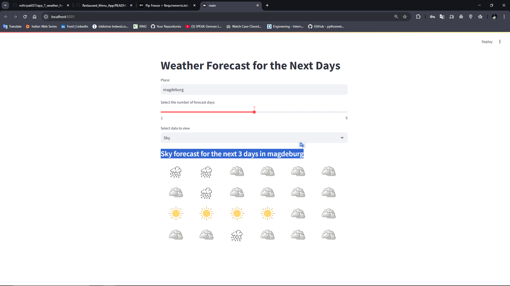
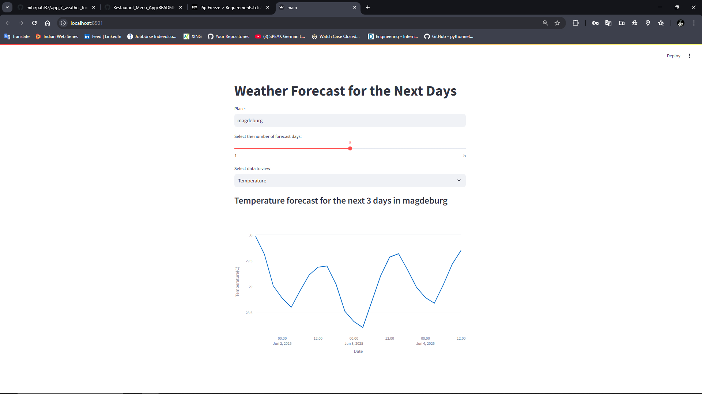

# Weather Forecast Dashboard

A user-friendly Streamlit web app to view weather forecasts (temperature and sky conditions) for the next few days using the [OpenWeatherMap API](https://openweathermap.org/forecast5).

---

## Screenshots
### Sky Forecast View


### Temperature Forecast View


---

## Features

- 🌍 Input any city name to get weather data
- 📅 Choose forecast range from 1 to 5 days
- 🌡️ View either temperature trends or sky conditions
- 📈 Interactive line chart for temperature
- 🌥️ Weather icons for clear, cloudy, rainy, and snowy conditions

---

## How It Works

### `main.py`
- Streamlit-based frontend
- Gets user input (place, forecast days, data type)
- Calls backend for forecast data
- Displays either a temperature chart or sky condition icons

### `backend.py`
- Uses `requests` to fetch weather data from OpenWeatherMap
- Filters forecast data based on user selection

---

## Weather Icons Used

| Condition | Icon      |
|----------|-----------|
| Clear    | ☀️ `clear.png`  |
| Clouds   | ☁️ `cloud.png`  |
| Rain     | 🌧️ `rain.png`   |
| Snow     | ❄️ `snow.png`   |

---

## Installation

1. **Clone the repository**

```bash
git clone https://github.com/mihirpatil37/app_7_weather_forecast_dashboard.git
cd app_7_weather_forecast_dashboard
```
2. **Install dependencies**

```bash

pip install -r requirements.txt
```
3. **Run the app**
```bash
streamlit run main.py
```
## API Key Setup
Get a free API key from OpenWeatherMap and replace it in backend.py:

```python
API_KEY = "your_api_key_here"
```
## Related Project: Weather Data REST API
Check out the Weather Data REST API built with Flask for historical weather records.

```bash
git clone https://github.com/mihirpatil37/app_6_your_weather_api.git
cd app_6_your_weather_api
pip install flask pandas
python app.py
```

## Project Structure
```css
weather_dashboard/
├── main.py
├── backend.py
├── requirements.txt
├── images/
│   ├── clear.png
│   ├── cloud.png
│   ├── rain.png
│   ├── snow.png
│   ├── sky_forecast_screenshot.png
│   └── temperature_forecast_screenshot.png
```
